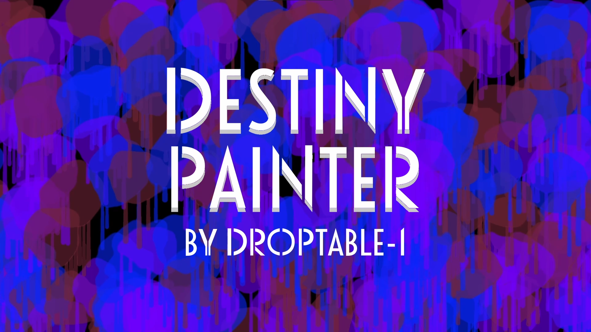
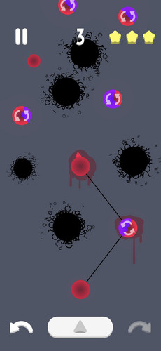
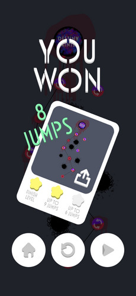

<h1 align="center">Destiny Painter</h1>

  

## What is it?

**Destiny Painter** is a Unity game created for the ZTGK competition in just 4 months, inspired by the [murals of Łódź](https://lodz.travel/turystyka/co-zobaczyc/murale/).

## Overview

**Destiny Painter** is an arcade-style game where you jump between colorful planets, leaving a trail behind you.

You can only land on planets that match your color, so plan each jump carefully, collect color changers, and avoid black planets to reach the end of the level. Precision and the number of jumps matter — they determine how many stars you earn. 

Each level is a new mural, inspired by **Tauros** by **Opiemme**, which you can complete yourself.

## How to play?

Link: https://muppetsg2.itch.io/destiny-painter

## Gameplay

  

## Tech Stack

- Engine: Unity 6000.0.24f1

## Screenshots

  
  

## Credits

| Name | Link | Role |
|------|--------|--------|
| Marceli Antosik | https://github.com/Muppetsg2 | Art Lead & VFX & Game Design |
| Patryk Antosik | https://github.com/MAIPA01 | Player Movement & Animation Programming |
| Bartłomiej Włodarski | https://github.com/BartlomiejWlodarski | Planets Behaviour Programming |

## License

Repository is licensed under the **All rights reserved**.

See the [LICENSE](./LICENSE) file for more information.

> You're under no obligation to choose a license. However, without a license, the default copyright laws apply, meaning that you retain all rights to your source code and no one may reproduce, distribute, or create derivative works from your work.
> https://docs.github.com/en/repositories/managing-your-repositorys-settings-and-features/customizing-your-repository/licensing-a-repository